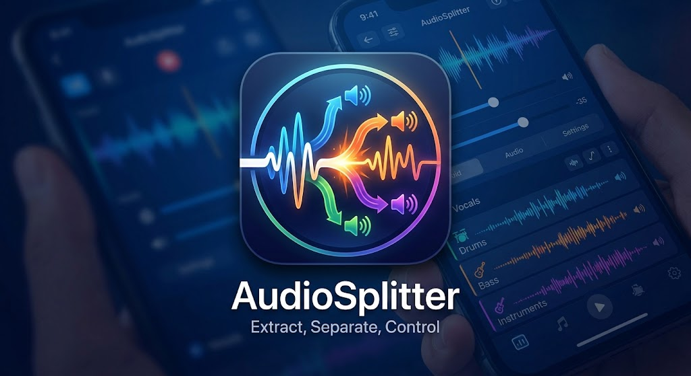

<div align="center">



**Extrae el audio de un video y lo parte en bloques de duración fija.**

</div>

---

## Qué hace

Toma un video, separa su pista de audio y la divide en segmentos secuenciales de duración
fija (30 minutos por defecto), sin dejar la ventana congelada mientras trabaja.

| | |
|---|---|
| **Extrae el audio** | Separa la pista del contenedor. Copia el stream sin recodificar cuando el formato lo permite. |
| **Segmenta por tiempo** | Bloques de duración fija; el último conserva el resto sin rellenar. El corte es por tiempo, no por tamaño. |
| **Informa el avance** | Cada progreso de FFmpeg se traduce en un evento que la interfaz consume sin bloquear el hilo de UI. |
| **Carpeta dinámica** | La ruta de trabajo se resuelve en ejecución, en cada corrida. Nada fijo en el código. |

Formatos de salida: `.m4a` (copia de stream, rápido y sin pérdida) o `.mp3`
(recodifica, máxima compatibilidad).

## Requisitos

- **.NET 10 SDK**
- **FFmpeg** y **ffprobe** — se buscan primero junto al ejecutable y, si no están, en el `PATH`
- **Windows** — la interfaz es Windows Forms

## Cómo correrlo

```bash
dotnet run --project src/AudioSplitter.UI
```

```bash
dotnet test
```

Un test puntual:

```bash
dotnet test --filter "FullyQualifiedName~EjemploDelDocumento"
```

## Distribución

Para llevar la aplicación a otra máquina, que puede no tener .NET ni FFmpeg instalados:

```bash
dotnet publish src/AudioSplitter.UI -c Release -r win-x64 --self-contained true -p:PublishSingleFile=true -o dist
```

La carpeta `dist/` queda con tres archivos y **no necesita nada instalado en el destino**:

```
dist/
  AudioSplitter.UI.exe    la aplicación y el runtime de .NET
  ffmpeg.exe
  ffprobe.exe
```

- FFmpeg se copia desde la máquina que compila. Si no está en `C:\ffmpeg\bin` ni en
  `C:\Program Files\ffmpeg\bin`, indicá la carpeta con
  `-p:FfmpegDir="D:\ruta\a\ffmpeg\bin"` o con la variable `FFMPEG_DIR`.
  Si no se encuentra, la compilación avisa y la aplicación queda dependiendo del `PATH`.
- El tamaño depende del build de FFmpeg que uses. Los builds *full* pesan mucho más que
  los *essentials*; si el paquete te queda grande, ese es el primer lugar donde mirar.

> **Antes de distribuir**: los builds completos de FFmpeg suelen ser GPL. Distribuir los
> binarios junto a la aplicación arrastra obligaciones de licencia. Revisalo.

## Arquitectura

Cuatro capas con dependencias en una sola dirección, más una raíz de composición.

```
UI  ──▶  Domain  ──▶  (interfaces)  ◀──  Core
 │         │                              │
 └─────────┴──────────▶ Contracts ◀───────┘        Contracts no referencia a nadie

                    Bootstrap
        el único que conoce las cuatro a la vez
```

| Proyecto | Responsabilidad |
|----------|-----------------|
| `AudioSplitter.Contracts` | DTOs, interfaces y el evento de progreso. **Cero dependencias.** |
| `AudioSplitter.Core` | Invoca FFmpeg como proceso externo. No decide reglas. |
| `AudioSplitter.Domain` | Orquesta, valida y consolida. No conoce FFmpeg. |
| `AudioSplitter.Bootstrap` | Raíz de composición: arma el grafo de dependencias. |
| `AudioSplitter.UI` | Windows Forms. Traduce interacción en petición y respuesta en pantalla. |

### Reglas que el diseño sostiene

1. **Contracts no depende de nadie.** Permite reemplazar Core sin tocar UI ni Domain.
2. **FFmpeg vive solo en Core.** Ninguna otra capa conoce su ruta, sus argumentos ni su salida.
3. **Domain no referencia Core.** Recibe la implementación por inyección desde Bootstrap,
   y por eso se prueba entero sin FFmpeg instalado.
4. **La excepción técnica nunca llega cruda a la pantalla.** Domain la traduce a un motivo
   de negocio antes de devolverla.
5. **La regla de los bloques vive en un solo lugar** (`CalculadoraSegmentos`, en Domain).
   Core recibe el plan ya resuelto y solo lo ejecuta.

## Pruebas

**36 en total.**

| Proyecto | Qué cubre |
|----------|-----------|
| `AudioSplitter.Domain.Tests` | 32 tests de dominio con dobles. Corren **sin FFmpeg instalado**. |
| `AudioSplitter.Integracion.Tests` | 4 tests de extremo a extremo. Generan su propio video con FFmpeg y verifican los archivos de salida con ffprobe. Se saltan si FFmpeg no está. |

## Estructura

```
src/
  AudioSplitter.Contracts/    DTOs, interfaces, evento de progreso
  AudioSplitter.Core/         FFmpeg como proceso externo
  AudioSplitter.Domain/       orquestación, validación, la regla de los bloques
  AudioSplitter.Bootstrap/    raíz de composición
  AudioSplitter.UI/           Windows Forms
tests/
  AudioSplitter.Domain.Tests/
  AudioSplitter.Integracion.Tests/
docs/
  Detalle_Arquitectura_AudioSplitter.md   diseño de origen
  imagen.jpg                              arte de marca
```

## Carpeta de trabajo

La elige el usuario en cada corrida. Se crea si no existe:

```
[carpeta elegida]
├── temp      audio completo extraído  (se borra siempre al cerrar)
└── salida    audio_parte_001 … audio_parte_00N
```

Si el proceso se cancela a mitad de camino, **los segmentos ya escritos se conservan**.
Solo se limpia lo temporal.

## Pendiente

- **Revisar la licencia de FFmpeg antes de distribuir.** Los builds completos suelen ser GPL,
  y eso condiciona cómo puede publicarse la aplicación. No hay licencia definida para este
  proyecto todavía.
- Definir si se recuerda la última carpeta de trabajo entre ejecuciones.
